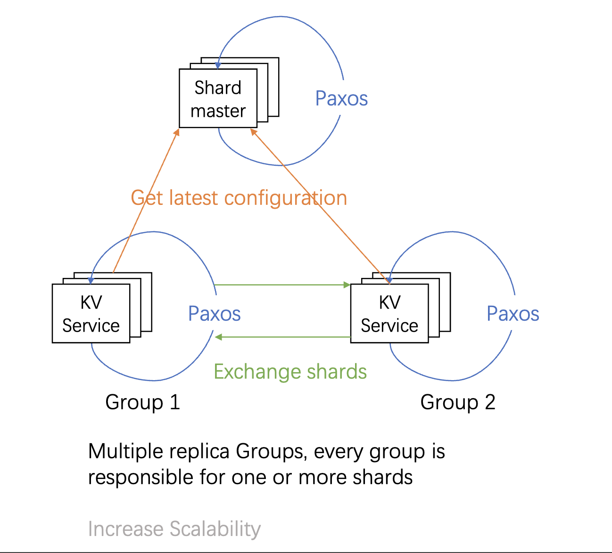

## Paxos-based sharded key-value Server
This project is an individual assignment for Fundamentals of Large-scale Distributed Systems at Columbia University.
## Introduction
This project implements a sharded key/value storage system designed to support scalability by partitioning data across multiple replica groups. Each replica group is responsible for managing a subset of key/value pairs, referred to as "shards." The system supports dynamic reconfiguration to handle load balancing and the addition or removal of replica groups. The architecture consists of:

1. Replica Groups: Each replica group is responsible for a subset of all the shards. A replica consists of a handful of servers (kvserver) that use Paxos to replicate the group's shard.
2. Shard Master: A fault-taulerant centralized service that determines shard assignments and maintains configuration consistency.


Configuration changes occur over time. Initially, the client consults the shardmaster to determine which shard a given key belongs to. Using this shard information and the corresponding server name, the client sends an RPC request to the server. If the requested key is present on that server, the server performs the necessary Get or Put operations on the key. Otherwise, it returns an error to the client via RPC.

Additionally, the shard KV server periodically communicates with the shardmaster to check for configuration updates. If the configuration changes, the KV server transfers its shards to the designated destination servers as specified by the new configuration. This transfer is also handled through RPC communication.

Both the shard KV server and the shardmaster are designed to handle concurrent operations while maintaining consistency across the data.

The general architecture (a configuration service and a set of replica groups) of the project is patterned at a high level on a number of systems: Flat Datacenter Storage, BigTable, Spanner, FAWN, Apache HBase, Rosebud, and many others. These systems differ in many details from this project, though, and are also typically more sophisticated and capable. For example, the project lacks persistent storage for key/value pairs and for the Paxos log; it sends more messages than required per Paxos agreement; it cannot evolve the sets of peers in each Paxos group; its data and query models are very simple; and handoff of shards is slow and doesn't allow concurrent client access.

## Sharmaster
The Shardmaster manages a sequence of numbered configurations, each describing a set of replica groups and an assignment of shards to those groups. The configuration updates dynamically as replica groups join, leave, or when specific shards are moved.

Key/value clients and servers communicate with the Shardmaster to obtain the current or past configurations. These configurations determine the mapping of shards to replica groups, enabling load balancing and ensuring the system remains operational during changes.

### RPC Interface
The Shardmaster exposes the following RPC operations:

1. Join (GID, Servers[])
Adds a new replica group to the system. The Shardmaster creates a new configuration that includes the group and rebalances shards across all groups as evenly as possible while minimizing shard movement.

2. Leave (GID)
Removes an existing replica group. The Shardmaster creates a new configuration that excludes the group and reassigns its shards to the remaining groups. Shards are rebalanced evenly, with minimal movement.

3. Move (Shard, GID)
Moves a specific shard to a designated group. This operation primarily serves testing purposes or fine-tunes load balancing. Subsequent Join or Leave operations may override manual moves due to automatic rebalancing.

4. Query (ConfigNum)
Retrieves a specific configuration by its number. If the requested number is -1 or greater than the latest configuration, the Shardmaster returns the latest configuration. The first configuration (Config 0) contains no groups and assigns all shards to GID 0 (an invalid GID).

The Shardmaster uses Paxos for replication to maintain consistency across multiple servers in the system. Paxos ensures that:

- Consensus: All Shardmaster replicas agree on the sequence of configurations, even in the presence of failures.
- Fault Tolerance: The system can continue operating as long as a majority of Shardmaster servers are available.
- Durability: Updates to configurations are reliably replicated across servers, ensuring no loss of data.

## kV server
This platform serves as a distributed data storage system. Each Key-Value (KV) server operates as part of a Paxos replica group, where every server within the group maintains an identical key-value store. If a server falls behind due to network partitioning, the Paxos protocol enables it to catch up by learning about the missed operations once it becomes reachable again.

### Major Operations of the KV Server
1. Get
Retrieves the value associated with a given key from the key-value store.

2. Put
Updates or inserts a key-value pair into the store.

3. Reconfigure
Periodically checks with the Shardmaster for configuration changes. If a change is detected, the server sends shards it owns to their newly assigned replica groups based on the updated configuration.

4. ReceiveShard
Handles incoming shards from other servers during reconfiguration. The received shard data is used to update the server's key-value store.

5. Ensuring Consistency and Concurrent Access
Consistency During Operations: The server ensures consistency of the key-value store even during concurrent access.
Reconfiguration Safety: If a reconfiguration is in progress, Get and Put operations are temporarily paused to prevent inconsistencies in the database. This guarantees that the data remains synchronized and stable during shard migrations.
Through the combination of Paxos for replication, careful handling of reconfiguration, and safeguards for concurrent access, this system ensures robust, consistent, and highly available distributed data storage.

## Client
lients interact with replica groups via RPCs to perform three key operations:

1. Put(key, val) – Updates the value of a given key.
2. Get(key) – Retrieves the current value of a key.
3. PutHash(key, val) – Updates the value of a key and returns its previous value, where the new value is computed as new_val = hash(prv_val + val).
T
he storage system guarantees sequential consistency for applications using its client interface. Specifically, all completed application calls to Clerk.Get(), Clerk.Put(), and Clerk.PutHash() methods in shardkv/client.go must appear to have affected all replicas in the same order, with at-most-once semantics. This means:

A Clerk.Get() should always return the most recent value written by the corresponding Put() or PutHash() operation for the same key.
Each application call to Clerk.Put() must appear to be executed once and in order, ensuring that the key-value database is updated exactly once. However, internally, the client.go may need to send multiple Put() and PutHash() RPCs to find a responsive kvpaxos server replica, due to potential network unreliability.
This approach becomes more complex when Get and Put requests coincide with configuration changes, requiring careful handling to maintain consistency and avoid conflicts.

## Usage
To test the program, go to shardkv folder and run --
```go
go test -run  'TestFunction'